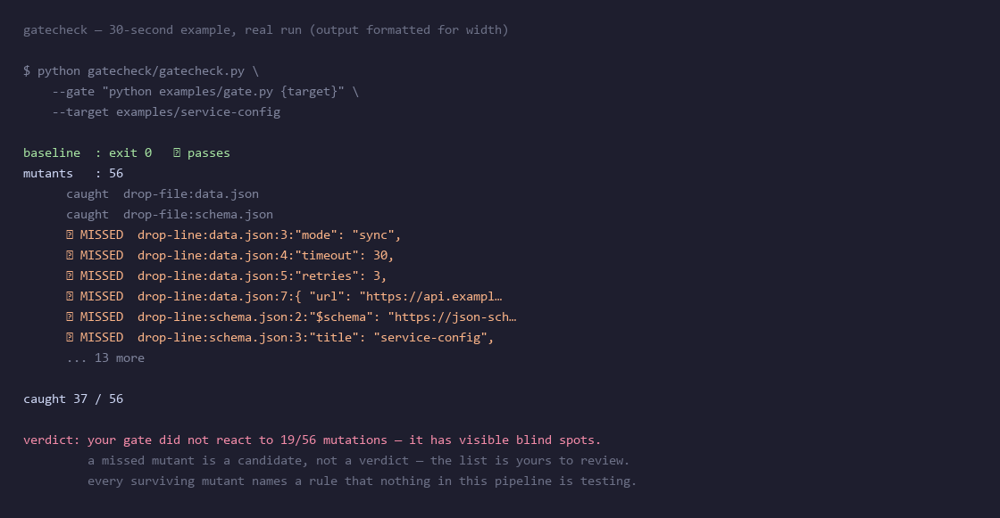

# gatecheck

**Your gate can silently lose a rule and CI stays green. gatecheck finds the rules nothing is actually testing.**

Point it at your own rules — a JSON Schema, a CI check, a lint or policy config, an LLM
guardrail — together with the command that is supposed to reject bad input. gatecheck
deletes and corrupts one line at a time, re-runs that command for every edit, and reports
the edits it did not react to. Each survivor names a rule that nothing in your pipeline is
testing.

**30 seconds, nothing to install:**

```bash
git clone https://github.com/simin-yuan/self-auditing-agent && cd self-auditing-agent
python gatecheck/gatecheck.py \
  --gate "python examples/gate.py {target}" \
  --target examples/service-config
```



Keep your gate command outside `--target` — otherwise gatecheck will point the mutations at
the gate itself.

Any command that exits non-zero to mean "reject" works as the gate — a linter, a CI step, a
schema validator, your own `validate.py`. **Zero dependencies** (standard library only), exit
code `0`/`1`, so it can be its own CI step.

> **It does not give you a verdict. It gives you a list.** A surviving mutant is a candidate,
> not a defect: in the run above most of the survivors are harmless (deleting a `title`,
> deleting an optional property). A tool that shouted "19 defects!" would be lying to you,
> and you would stop believing it the second time you checked.

**Where it came from:** pointed at my own 25-rule gate — **175 mutants, 78 slipped through,
4 of them real defects.** The worst one is a real design defect, not a simulated one: a rule
whose trigger condition is supplied by the party being inspected — *"if you declare yourself
non-interactive, you must be registered"* — so deleting the declaration removes the
requirement. *A check that only applies once you admit guilt is not a check.* All four are
documented, including the ones I have **not** fixed: [docs/BLIND-SPOTS.md](docs/BLIND-SPOTS.md).

---

# The archive this tool came out of

**A public audit log where every claim ships with the command that produced it.**

**The failures are in here on purpose.**

> An AI system earns trust to the extent that it lets you check where it went wrong.

**Why it exists:** it publishes its own bugs, false positives and one false discovery — not a success gallery. Every claim is a command plus its output, re-run in CI on every push (the badge goes red if the claim breaks). Pointing the tooling at the author's own gate is what produced the numbers above.

[](https://github.com/simin-yuan/self-auditing-agent/actions/workflows/verify.yml)
[](LICENSE)

**Quick start** (stdlib only, Python ≥ 3.9, no credentials, no services):

```bash
git clone https://github.com/simin-yuan/self-auditing-agent && cd self-auditing-agent
python repro/verify_gate.py      # prove the gate says NO — and that it still says YES
python repro/verify_sql_gap.py   # reproduce the headline finding, offline
```

**How to verify:** run those commands yourself · check the CI badge (the claim is re-run on a clean machine every push) · read [docs/BLIND-SPOTS.md](docs/BLIND-SPOTS.md) for the four defects that are *not* fixed yet.

| Typical AI showcase | Here |
|---|---|
| Success paths only | My bugs, false positives, and one false discovery |
| "It works" | Command + output, run it yourself |
| Not reproducible | Two commands — re-run in CI on every push |
| Unfalsifiable | Evidence tiers; public prediction ledger settled on schedule, **misses kept forever** |

**Volume 1**: a 74-minute forensic audit of an unfamiliar technical system — including an **adversarial finding** (a read-only SQL endpoint shipped without a table allowlist, with the vulnerable pattern reproduced here by a self-written minimal example), a fix, a 25-rule validator suite with fired-rule evidence, **4 of my own bugs**, and one false discovery I caught myself.

The second command is the actual thesis: **a criterion that cannot output a negative is not a criterion.** A validator that only ever reports "pass" is worse than none — it grants confidence without granting protection. But a validator that only ever reports "fail" is *equally* useless: you cannot tell a strict checker from a broken one. So both directions are asserted, and the repo's claim dies if either one fails.

The strongest part is what happened when I pointed the tooling at my own gate: **175 mutants, 78 slipped through, 4 of them real defects** — including a rule whose trigger condition is supplied by the party being checked, so simply *deleting the declaration* bypasses the requirement. Full diagnosis in [docs/BLIND-SPOTS.md](docs/BLIND-SPOTS.md). None of the four are fixed yet; that file is a diagnosis, not a repair log.

---


<details>
<summary><b>Why the fixtures stay in Chinese, and every file that keeps them</b></summary>

The meta-model under test is a **Chinese enterprise model**: the documents are written in
Chinese business language, and the validator accepts a Chinese column header as well as the
English one. Translating the corpus would change what the fixture is testing, so it is kept
as-is. The list below is the complete set of files in this repository that still contain any
Chinese character -- everything else (README, volumes, docs, code comments and docstrings,
CI job and step names, and every output string) is English.

<!-- CJK-MANIFEST:BEGIN -->
- `docs/BLIND-SPOTS.md` — 6 character(s)
- `repro/fixtures/broken-meta-model/business-function-requirements.md` — 16 character(s)
- `repro/fixtures/broken-meta-model/database-model.md` — 8 character(s)
- `repro/fixtures/broken-meta-model/database-schema.md` — 10 character(s)
- `repro/fixtures/broken-meta-model/domain-model.md` — 31 character(s)
- `repro/fixtures/broken-meta-model/function-chain-index.md` — 9 character(s)
- `repro/fixtures/broken-meta-model/functional-inventory.md` — 29 character(s)
- `repro/fixtures/broken-meta-model/non-menu-function-index.md` — 19 character(s)
- `repro/fixtures/broken-meta-model/source-asset-inventory.md` — 14 character(s)
- `repro/fixtures/broken-source/com/demo/OrderController.java` — 40 character(s)
- `repro/fixtures/broken-source/schema.sql` — 16 character(s)
- `repro/fixtures/make_valid.py` — 201 character(s)
- `repro/fixtures/valid-empty/PROGRESS.md` — 2 character(s)
- `repro/fixtures/valid-empty/business-architecture.md` — 4 character(s)
- `repro/fixtures/valid-empty/business-function-requirements.md` — 4 character(s)
- `repro/fixtures/valid-empty/change-hotspots.md` — 4 character(s)
- `repro/fixtures/valid-empty/common-capability-index.md` — 6 character(s)
- `repro/fixtures/valid-empty/config-index.md` — 4 character(s)
- `repro/fixtures/valid-empty/consistency-report.md` — 5 character(s)
- `repro/fixtures/valid-empty/data-ownership.md` — 4 character(s)
- `repro/fixtures/valid-empty/database-access-matrix.md` — 7 character(s)
- `repro/fixtures/valid-empty/database-inventory.md` — 5 character(s)
- `repro/fixtures/valid-empty/database-model.md` — 5 character(s)
- `repro/fixtures/valid-empty/database-relations.md` — 5 character(s)
- `repro/fixtures/valid-empty/database-schema.md` — 3 character(s)
- `repro/fixtures/valid-empty/domain-model.md` — 4 character(s)
- `repro/fixtures/valid-empty/flow-index.md` — 4 character(s)
- `repro/fixtures/valid-empty/function-chain-index.md` — 3 character(s)
- `repro/fixtures/valid-empty/functional-inventory.md` — 4 character(s)
- `repro/fixtures/valid-empty/interface-index.md` — 4 character(s)
- `repro/fixtures/valid-empty/meta-index.md` — 5 character(s)
- `repro/fixtures/valid-empty/module-index.md` — 4 character(s)
- `repro/fixtures/valid-empty/non-menu-function-index.md` — 5 character(s)
- `repro/fixtures/valid-empty/source-asset-inventory.md` — 6 character(s)
- `repro/fixtures/valid-empty/source-coverage-report.md` — 6 character(s)
- `repro/fixtures/valid-empty/technical-architecture.md` — 4 character(s)
- `repro/fixtures/valid-empty/technical-component-index.md` — 6 character(s)
- `repro/fixtures/valid-meta-model/PROGRESS.md` — 2 character(s)
- `repro/fixtures/valid-meta-model/business-architecture.md` — 14 character(s)
- `repro/fixtures/valid-meta-model/business-function-requirements.md` — 37 character(s)
- `repro/fixtures/valid-meta-model/change-hotspots.md` — 4 character(s)
- `repro/fixtures/valid-meta-model/common-capability-index.md` — 6 character(s)
- `repro/fixtures/valid-meta-model/config-index.md` — 4 character(s)
- `repro/fixtures/valid-meta-model/consistency-report.md` — 5 character(s)
- `repro/fixtures/valid-meta-model/data-ownership.md` — 4 character(s)
- `repro/fixtures/valid-meta-model/database-access-matrix.md` — 7 character(s)
- `repro/fixtures/valid-meta-model/database-inventory.md` — 5 character(s)
- `repro/fixtures/valid-meta-model/database-model.md` — 8 character(s)
- `repro/fixtures/valid-meta-model/database-relations.md` — 5 character(s)
- `repro/fixtures/valid-meta-model/database-schema.md` — 18 character(s)
- `repro/fixtures/valid-meta-model/domain-model.md` — 6 character(s)
- `repro/fixtures/valid-meta-model/flow-index.md` — 4 character(s)
- `repro/fixtures/valid-meta-model/function-chain-index.md` — 28 character(s)
- `repro/fixtures/valid-meta-model/functional-inventory.md` — 21 character(s)
- `repro/fixtures/valid-meta-model/interface-index.md` — 8 character(s)
- `repro/fixtures/valid-meta-model/meta-index.md` — 5 character(s)
- `repro/fixtures/valid-meta-model/module-index.md` — 4 character(s)
- `repro/fixtures/valid-meta-model/non-menu-function-index.md` — 16 character(s)
- `repro/fixtures/valid-meta-model/source-asset-inventory.md` — 12 character(s)
- `repro/fixtures/valid-meta-model/source-coverage-report.md` — 6 character(s)
- `repro/fixtures/valid-meta-model/technical-architecture.md` — 4 character(s)
- `repro/fixtures/valid-meta-model/technical-component-index.md` — 6 character(s)
- `repro/validate_meta_model.py` — 4 character(s)
<!-- CJK-MANIFEST:END -->

</details>
## Related tools

Small, falsifiable verification tools that fit together:

- **[greencheck](https://github.com/simin-yuan/greencheck)** — mutation testing for validators.
- **[precheck](https://github.com/simin-yuan/precheck)** — make an agent prove its claims with checks it was forbidden to write.
- **[agent-pushgate](https://github.com/simin-yuan/agent-pushgate)** — pre-push privacy / scope / history gates.

## License

Code is MIT — see [`LICENSE`](LICENSE). Documentation under `volumes/` and `docs/` is CC BY 4.0 — see [`LICENSE-docs`](LICENSE-docs).
